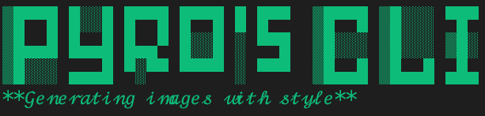
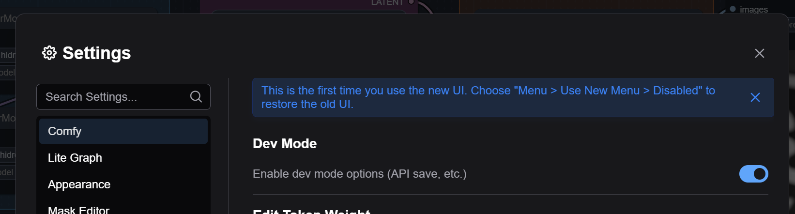
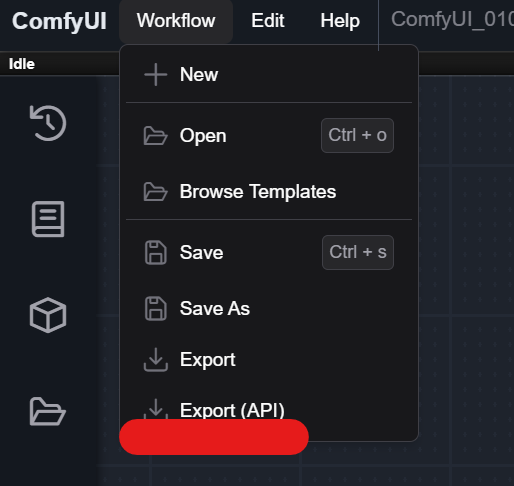
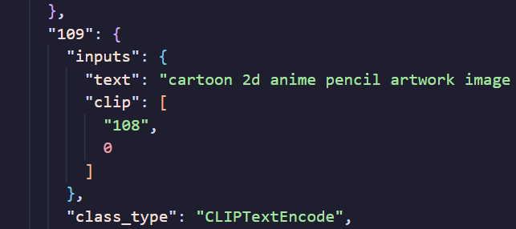
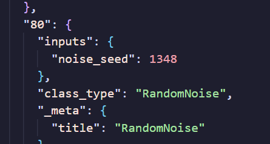
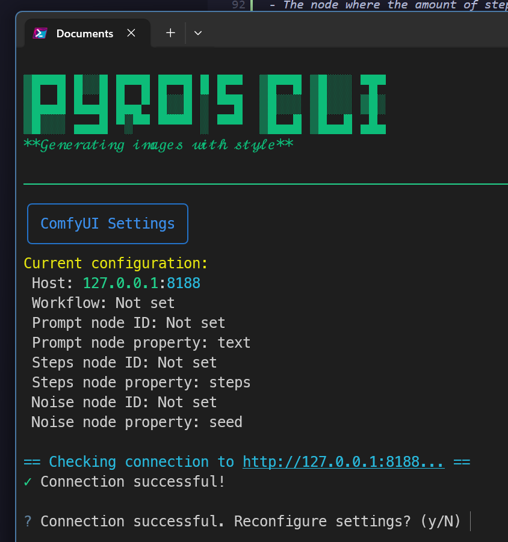
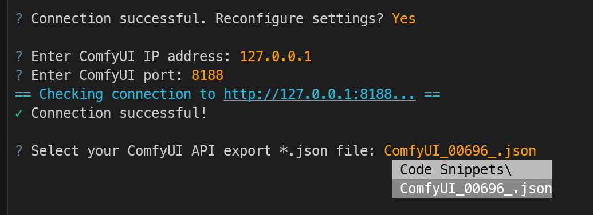
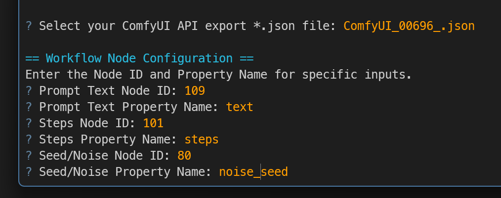

<p align="center">
  
</p>

<p align="center">
  <!-- Update badges -->
  <a href="https://pypi.org/project/pyros-cli/" target="_blank"></a>
  
</p>

<p align="center">
<b>A CLI for exploring prompts</b>
</p>

You hate writing prompts? But you love the results of good prompts?

You hate that you can't use ComfyUI just with a keyboard and need to use a mouse all the time?

Then this is the tool for you!

Generate and explore amazing prompts with ease, while having fun with it because of a well thought out process.

<p align="center">
  
</p>

Pyro's CLI works with:

- virtually **any ComfyUI workflow** (Images, videos whatever you want)
- supports ollama, openai, anthropic, groq (with 'q'), gemini for its optional **advanced AI features** (currently in progress)


Pyro's CLI enables you to:

- create **dynamic prompts** via prompt variables
- do batch generation
- take any prompt as start and let AI **enhance** it, **create prompt templates** out of it, and chat **gpt-4o style** with it until you get the image you have in your head (currently in progress)

all while leaning back with your keyboard and not having to worry about spaghetti cables and nodes.


## Requirements

A terminal that supports more than two colors.

`iterm2` on macOS is recommended or the surprisingly good  `Windows Terminal` on Windows.

https://iterm2.com/

https://github.com/microsoft/terminal


## Installation

### Install uv

Make your live easy and get `uv` installed.
It's a package and project manager for python which requires neither python installed nor knowledge of python.


https://docs.astral.sh/uv/getting-started/installation/


### Install pyros-cli

Create a new directory, navigate with your terminal into it and run:

```bash
uvx --prerelease=allow pyros-cli
```

That's it!

## Setup


### **1. Open ComfyUI**

Start ComfyUI and open your favorite workflow.

Doesn't matter if video or image or whatever else!

In the settings activate **Dev Mode**


  


### **2. Export your workflow**

Export your workflow in API mode.

Save it into the directory you created during the installation


  


### **3. Getting required node information**

To let Pyro's CLI know how it needs to interact with your workflow and to guarantee maximum compatibility it needs some information about some nodes.

Open the exported workflow in a text editor of your choice and search for following nodes:

- The node where your prompt is defined
- The node which generates the seed
- The node where the amount of steps for generation is set

For each node write down its id (usually a number), and how the property is called

For example in my workflow this is the prompt node:


  


We will note "109" and "text"

And for the seed node we note "80" and "noise_seed"


  


### **4. Run Pyro's CLI and set up the connection to ComfyUI**

Start Pyro's CLI with `uvx --prerelease=allow pyros-cli`


  

Hit 'y' for reconfiguring the settings.

Enter the right values for your network setup (if ComfyUI is running on the same computer the defaults should work right away)

Set your exported workflow




Then enter the values you got from the previous step




You did it!

Pyro's CLI is now configured and good to go. Don't worry, it'll remember your inputs and you only have to reconfigure them if you want to change workflows!

## Create some f***ing art

Let's explore what Pyro's CLI offers!

### Generate an image

Type in some text, hit enter, enjoy


https://github.com/user-attachments/assets/4c3df4d1-c3ac-4f01-8ad0-e439f1211cf9


### Using prompt variables

Use prompt variables for dynamic prompt generation.


https://github.com/user-attachments/assets/2c0fc3df-6bca-480e-8102-25a4342e7b7a


### Batch generation

### Optimize your prompts with AI

## Commands

Besides prompts you can also input commands.

Get a list of them with `/help`

Here an overview:

### Web Gallery

Use the `/gallery` command to open the gallery in your browser (Cntrl+C to close)

https://github.com/user-attachments/assets/e6b25a57-af60-4810-9797-8f3a64b7d713

## Pyro's CLI prompt syntax & other concepts

### Base prompt and evaluated prompt

The prompt you type in is the so-called **Base Prompt**

This prompt will get evaluated by static algorithms and/or AI and will result in the evaluated prompt we will call **Eval Prompt**

### Prompt Variables

Prompt variables are text files containing lines of possible value.
For example `__animal__` contains a list of animals, and by executing the prompt a random animel will get chosen

Usage:
```
__variablename__ # will get replaced with a random entry of this variable
__variablename:123__ # will get replaced with entry 123 of this variable

# some provided prompt vars

__75k__ # 75000 prompts
__animal__ # some cute animals
__builder/*__ # some building blocks
```


## Gallery

Some stuff generated after 2 seconds of using Pyro's CLI:

<table>
  <tr>
    <td></td>
    <td></td>
    <td></td>
  </tr>
  <tr>
    <td></td>
    <td></td>
    <td></td>
  </tr>
  <tr>
    <td></td>
    <td></td>
    <td></td>
  </tr>
  <tr>
    <td></td>
    <td></td>
    <td></td>
  </tr>
  <tr>
    <td></td>
    <td></td>
    <td></td>
  </tr>
  <tr>
    <td></td>
    <td></td>
    <td></td>
  </tr>
</table>

