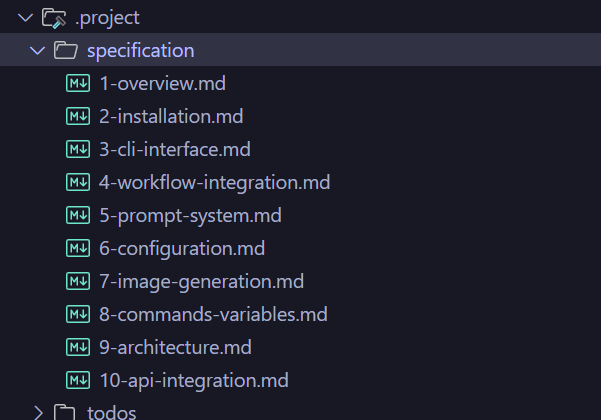
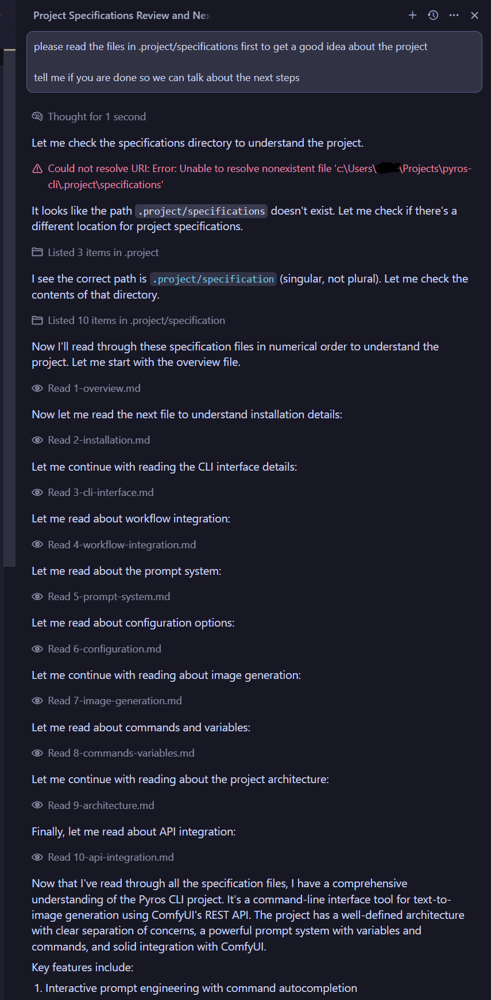
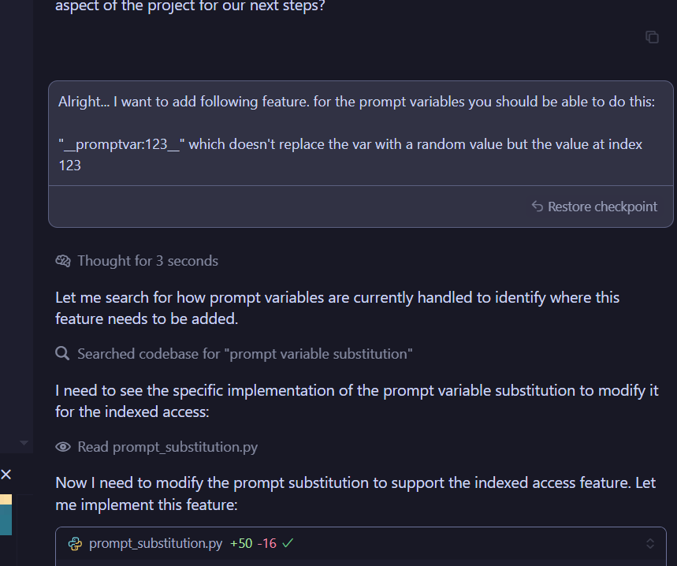
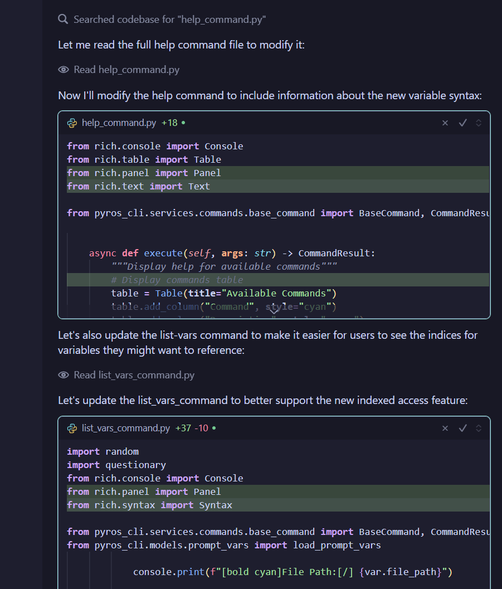
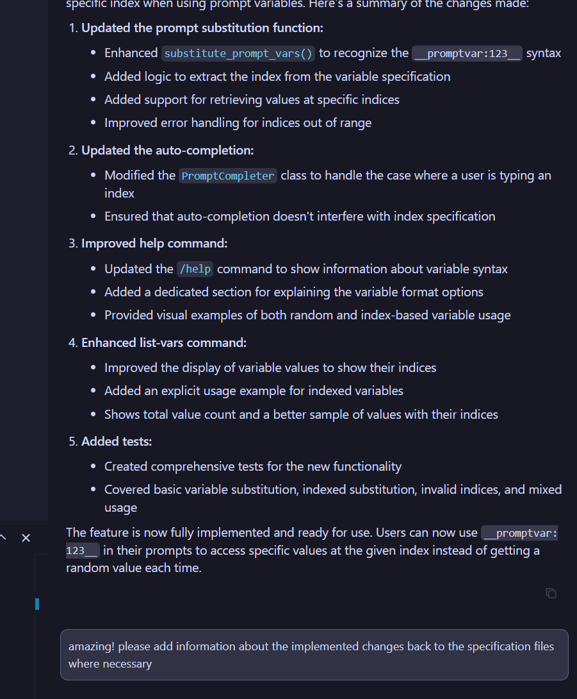

  

Since a couple of months I don't write code anymore. Literally. Be it in private or at work.

Only in some edge cases is it necessary to create code on your own.

Still you'll often read on the internet that AI is still far away from being able to do this, and except for small snippets of code it is not usable.

This shows only one thing: people are really too stupid to use AI, because I'm letting AI implement complete enterprise solutions for more than half a year now.

This project, even way smaller in scope, is also not written but prompted, and the principles I used for this project are transferable to any size.

So what do you do in 4 simple steps?

## 1. Specifications

Let the AI document the current state of the solution.

Take a look at `.project/specification` to see how this could look like.

Basically a rundown of the current is-state of the project.

In this case it is just 10 files, but for really big projects you can expand this with an in-depth specialized structure and your favorite information retrieval algorithms.

Of course the whole specification is AI-generated. Especially LLMs with a big context size can do this pretty well, but even your standard 128k context LLMs should have no problem being smart about it, letting the LLM build these files on a per-module basis, and telling it if there are important code references spread throughout the codebase that it should keep in mind and take into account.

## 2. Tell it to read it every new session

That's it. The magic. Just tell the AI to read the specs before writing a single line of code.

## 3. Tell it what to implement

Tell it what you want. As you can see you don't have to explain shit.

Look at this: because it read the specs it even thinks of updating the help commands for this command change. Plenty of humans would forget this step. I did forget it, else I would had written it in the previous prompt.

## 4. When done tell it to update the specifications

Always keep your specs up to date. Session done.

---

Some tips:

- Keep your sessions short. A particular feature done? Session done. Create a new one. Keeps the AI focused on one job. A focused AI is a good AI.

- Some AI coding tools like Cursor let you use "rules" which define how Cursor should work. You can basically automate spec generation and keeping them up to date easily with them. Since it is part of my job to teach clients how to do it and it isn't that cheap, you have to figure it out yourself tho.

- https://ghuntley.com/specs/ - Geoff creates a whole agent framework with this method (and abusing Cursor rules) in case some brainlet wants to argue that this project here isn't complex enough. Read his journey.

- You can also create a backlog of todos, and let the AI track critical improvements you should do and whatnot... see `.project/todos`.

- Don't forget to laugh at people who are telling you that you can't create whole projects with just 'vibe coding'. They are wrong.

- Don't use the term 'vibe coding'. It's stupid.

**AND THE MOST IMPORTANT THING**

Whatever your coding forte is... backend or frontend, React or Angular, Python or .NET... doesn't matter. It is time to leave that behind and start thinking about improving your architecture skills and soft skills.

Solution and system design, talking to clients and translating "client-speak" into English and a viable real project, managing your own team (which will consist of a team of agents) will be the future.

Don't be the modern equivalent of the 60-year-old boomer coder who is refusing to do anything cloud related because he still thinks that "cloud is just a fad bro" then gets fired and will never find a new job ever again. The programming subs of Reddit are surprisingly full of those, just AI instead of cloud. It'll be a bloodbath 1-2 years down the road. 

But it will not be the fault of AI but your laziness and your "I know it better than actual scientists and experts". I work daily with AI researchers, and I have told people for five years how to prepare, but even now, basically on the edge of a new digital era, people still find excuses and stupid reasons to do absolutely nothing. Which I don't understand and blows my mind.

Look, even if I'm completely wrong, the worst thing that happens is that you learned some new skills every modern dev should have anyway, oh no. And now think about the worst thing that can happen if you are wrong, and nobody needs people who can only write code anymore.

Sounds like a pretty fucking easy decision, and I can only explain it with some kind of underlying issues of ego and self-confidence if that's still not enough to convince you to save your fucking ass.

Cheers.

